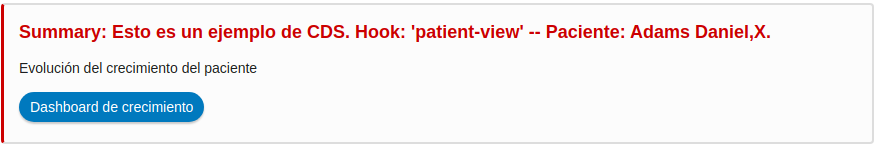
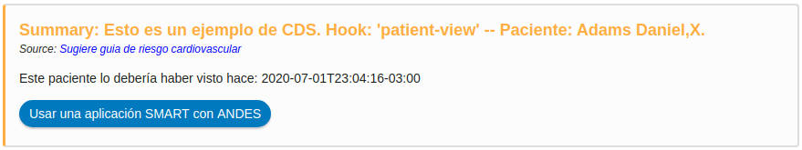

# cds-hooks
Un app muy sencilla en nodejs que nos permite mostrar el funcionamiento conceptual de un Sistema de soporte de decisión clínico basado en **HOOKS**.
# Instalación
1. npm i
2. npm run start
3. Asegurarnos que esté funcionando el servidor en el port 3000: http://localhost:3000
4. Ir al sitio: https://sandbox.cds-hooks.org/
5. El sanbox del punto anterior nos muestra un paciente en fhir (simularía nuestra HCE).
6. VAmos a la configuración del sandbox, y agregamos un nuevo servicio CDS (*add CDS Services*)
7. Registramos nuestro servicio como http://localhost:3000/cds-services ( *que correesponmde a nuestro servidor y la ruta donde tenemos publicado el servicio cds* )
8. Deberíamos poder visualizar las "cars" generadas para este ejemplo.

